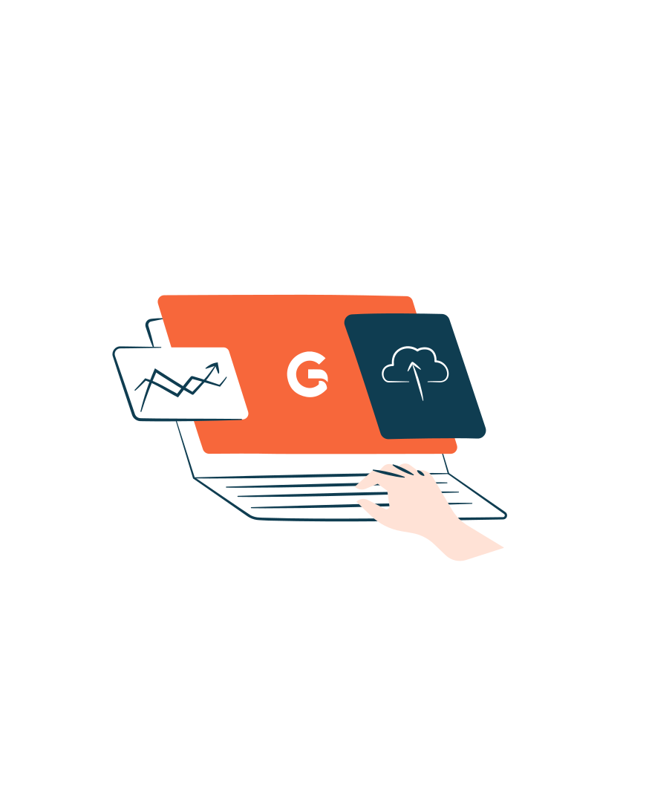

<!-- _class: lead -->

# AI-Assisted Development in Action

**Iikka Luoma-aho**
Lead AI Expert & People Lead, Gofore

*Devpool Keynote · 15 min*


<!--
SPEAKER NOTES (0:00-0:15)
- Let people settle. Stopwatch on.
- 15 minutes. Stay lean. Don't drift.
-->

---


## What today

1. **Who I am** — role, domains, my road through AI tooling
2. **Shared vocabulary** — what an agent is · the 4 levels of AI-assisted coding
3. **Reality of today** — live runs from a real repo
4. **What you should do** — starting Monday

<!--
SPEAKER NOTES (0:15-1:00) — ~45s

"Four things in fifteen minutes.

First — who I am and what my path through these tools has looked like.
With receipts.

Second — shared vocabulary. I'll define what an agent actually is, and
give you a ladder of four levels of AI-assisted coding so we're all
standing on the same ground.

Third — I'll show you live, in a real terminal, what the frontier looks
like today.

And fourth — I'll tell you what I think YOU should do about it, starting
Monday morning."

Transition: "So, me first."
-->

---


## Who I am

**Lead AI Expert & People Lead · Gofore**
Trainings · AI strategy · scalable AI architecture · applied AI · agentic tooling

- **50+ shipped production projects**
- Roles I've played: **ML lead · AI architect · developer · trainer · consultant**
- Domains: **telco · industry · public sector · healthcare**
- **Hands-on across ML:** CV (YOLO · ResNet) · NLP (classification · clustering · LLMs · SLMs · fine-tuning) · speech (ASR) · generative (Stable Diffusion) · time-series (LSTM · ARIMA) · RL (Q-learning)
- National AI trainer — Teknologiateollisuus *AI 1000* programme
- Architecture · MLOps/LLMOps · governance (AI Act · GDPR · NIS2)

<!--
SPEAKER NOTES (1:00-2:00) — ~1:00

"I'm Lead AI Expert and People Lead at Gofore. Over my career I've shipped
50+ production projects — across telco, industry, public sector, and
healthcare.

I've worn a lot of hats — ML lead, AI architect, developer, trainer,
consultant — depending on what the project needed.

On the ML side I've worked across the stack — not just LLMs. Computer
vision with YOLO and ResNet. NLP classification, clustering, LLMs and
small models, fine-tuning. Speech recognition. Generative models like
Stable Diffusion. Time-series with LSTMs and ARIMA. Reinforcement
learning with Q-learning. Point is — this isn't just a hype talk. I've
shipped the old stuff and the new stuff.

I'm also a national AI trainer for Teknologiateollisuus's AI 1000
programme, so I spend a lot of time teaching this stuff to executives
and teams across Finland.

My day job spans architecture, MLOps and LLMOps, governance work around
the AI Act, GDPR, NIS2 — and increasingly, agentic tooling to boost how
we actually ship software. That last one is what this talk is about."

Q&A ammo (DON'T volunteer unless asked):
- Named clients include Siemens (Software Defined Factory), Telia, S-Business,
  Cargotec–MacGregor, Ponsse, DVV, public healthcare regions
- MLOps stack: Azure Landing Zones, AKS, Vertex AI, Microsoft Foundry, Bedrock
- ML breadth beyond LLMs: BERT classifiers, NER/spaCy, LSTM+Q-learning for
  dynamic pricing, computer vision, speech-to-text fine-tuning
- Co-host of Telia's "Coffee with AI" weekly since Aug 2023 (40+ demos)
- MSc Telecom & Cybersecurity, BSc CS

Transition: "Now — how I got into AI coding specifically."
-->

---

## Me & AI coding

**Agentic coding daily since 2023**
Claude Code · Cursor · Aider · Copilot · Codex

### My road through the tools

- **2022** — Copilot beta · first taste of autocomplete
- **Dec 2022** — chat coding with GPT
- **Jul 2023** — Aider · first real agentic coding
- **2024** — Cursor + GitHub Copilot · also built my own agentic editor tool (never published)
- **2025** — Claude Code · Codex · GitHub Copilot CLI · Gemini CLI · Antigravity
- **2026 (now)** — mainly PI · orchestrating multiple agents in parallel

<!--
SPEAKER NOTES (2:00-3:30) — ~1:30

"My road through the tools — and why I trust what I'm about to show you.

2022 — Copilot beta. First taste of autocomplete.

December 2022 — started chatting with GPT for code. Like most of you
probably did.

July 2023 — Aider. My first REAL agentic coding. That's where the
mindset started to shift. I realized I was doing it wrong — still
chatting when I should have been planning.

2024 — Cursor became my daily driver, alongside GitHub Copilot in the
editor. And on the side I built my own agentic editor tool. Never
published it, but building it taught me what I was missing when I used
someone else's.

2025 — the big year. Claude Code, Codex, GitHub Copilot CLI, Gemini CLI,
Antigravity — I used them all. Agentic CLIs became the new frontier.

Now, 2026 — I'm mostly on PI, orchestrating multiple agents in parallel.
Level 4 territory.

This is a skill. It took me years to get here. It isn't theory — it's
scar tissue."

Transition: "Before I give you the ladder, one definition."
-->

---


## What is an agent?

# LLM + STATE + TOOLS + EVENT + GOAL

- **Event** triggers it — chat, commit, queue, webhook
- **State** is what it knows — files, history, plan
- **Tools** are what it can do — read, write, run, call APIs
- **Goal** is the stop condition — when is this thing *done*

Four ingredients. Miss one, it's not an agent — it's a chat.

<!--
SPEAKER NOTES (3:30-4:00) — ~30s

"Everyone means something different by 'agent'. Here's mine, stripped down:

An agent is an LLM with four things around it.

EVENT — anything that triggers it. Chat message, git commit, queue event,
webhook.

STATE — everything it knows. Files in context, history, current plan.

TOOLS — what it can reach for. Read a file. Run a command. Call an API.

GOAL — the stop condition. When is this thing DONE.

Four ingredients. Miss any one, it's not an agent — it's just a chat."

Transition: "Now — the ladder."
-->

---

## The 4 levels of AI-assisted coding

| Level | What it is | Where most are |
|-------|-----------|----------------|
| **1** | Context-aware autocomplete — Copilot, Cursor Tab, Tabnine | Everyone |
| **2** | Chat with an LLM — copy/paste into ChatGPT, Claude | Everyone |
| **2.5** | Chat integrated with code — Copilot Chat, Cursor Chat, Avante | **Most devs** |
| **3** | Agentic coding — AI writes, runs, iterates (Cursor agent, Codex, Claude Code) | Experimenting |
| **4** | **Programmable** agentic coding — sets of agents, workflows, and automated triggers that build the system | Few of us |

<!--
SPEAKER NOTES (4:00-6:30) — ~2:30. CORE FRAMING SLIDE.

Walk the levels. ~30s each. Paraphrase.

LEVEL 1 — "Autocomplete. Copilot suggestions, Cursor Tab, the old tool
Tabnine. Finishes a line based on your code and LSP info. Nothing more."

LEVEL 2 — "Chat. Copy your code into ChatGPT or Claude, ask a question.
Everyone here has done this."

LEVEL 2.5 — "Same, but the chat is wired into your editor. It can read
your files, search your codebase. Copilot Chat, Cursor Chat, Avante. This
is where most developers are today."

LEVEL 3 — "Agentic coding. The LLM doesn't just suggest — it writes files,
runs commands, reads output, tries again. Cursor agent mode, OpenAI Codex,
Claude Code, Windsurf. Many of you have tried it. Most people fail here —
because they're still chatting with it like it's level 2.5. Single
messages. Arguing with the AI. Wrong mindset."

LEVEL 4 — "Programmable agentic coding. Few of us are here. You don't
use an agent — you CREATE SETS of agents, workflows, and automated
triggers that build the system for you. Multiple models racing to ship
the same feature. Self-validating feedback loops. Systems wired to
events — issues, PRs, CI failures, schedules — so the agents fire
without you in the loop. Highest leverage, highest cost. Don't touch
level 4 until you've mastered level 3."

Transition: "Enough theory. Let me show you what this looks like in a
real repo, right now."
-->

---

<!-- _class: lead -->



# 🎬 Reality of today

## Three runs · each shorter · each more autonomous

`copilot-demo/`

<!--
SPEAKER NOTES (6:30-6:45) — ~15s

"Three runs. Each shorter than the last. Each more autonomous. Watch the
shift — from me prompting, to me orchestrating, to me not being in the
loop at all."

Switch to terminal. `cd copilot-demo`. Commands staged.
-->

---

## Demo A — single prompt (Level 2.5/3)

```bash
./dws/dw_prompt.py "Add input validation to apps/main.py"
```

**This is where most of you are.**
I prompt. It codes. I review. I'm the bottleneck for every task.

<!--
SPEAKER NOTES (6:45-7:45) — ~1:00

Run the command. While it streams:

"One-shot subprocess. I send a prompt, the CLI spins up, does the work,
writes output, exits. This is your level 2.5 and low level 3. I'm still
deciding what to ask, when to ask, and whether the result is good.

Most of you are HERE today. That's fine — but I'm the bottleneck for
every single task."

When it finishes, show the diff briefly.

Transition: "Now I'll let Python orchestrate instead of me typing."
-->

---

## Demo B — SDK orchestration (Level 4)

```bash
./dws/dw_sdk_prompt.py \
    "Review apps/main.py for OWASP issues" \
    --model claude-sonnet-4
```

Now I'm **programming the agent**.
Multi-model. Swappable. Composable. The agent is a function.

<!--
SPEAKER NOTES (7:45-9:15) — ~1:30

Run it. While it streams:

"Same idea, but now the agent is driven from Python. I can swap models —
Claude Sonnet, GPT-4o, Gemini — with a flag. I can chain sessions. Handle
permissions programmatically. Wrap retries, validators, custom tools.

This is the level 4 unlock: the agent is now a function I can call from
code. Which means it can be called by OTHER code. Which means..."

Point to next slide.

Transition: "...it can be called by EVENTS, not by me."
-->

---

## Demo C — event-triggered (Level 4)

```bash
./dws/dw_triggers/trigger_github_issue.py --label dw-trigger
```

- GitHub issue labeled `dw-trigger` → agent wakes up
- Reads the issue, plans, codes, posts back to the PR
- **I'm not in the loop.** Could fire at 3am.
- Sibling triggers: PRs · CI failures · filesystem drops · schedules

<!--
SPEAKER NOTES (9:15-11:15) — ~2:00

Start the trigger. While it polls:

"This is a trigger. It watches GitHub. When an issue gets labeled
'dw-trigger', the trigger launches a developer workflow with the issue
body as the prompt. Agent plans, codes, posts a comment back.

I didn't prompt. I wasn't at my keyboard. Could fire at 3am. There are
sibling triggers in the same repo — for PRs, CI failures, filesystem
drops, schedules.

This is what 'engineering systems that build systems' means. The prompt
isn't something I type anymore — it's something the system generates from
an event and feeds to an agent."

Show output briefly:
`agents/{dw_id}/{agent_name}/cp_final_object.json`

"Real output. Every run logged, parseable, auditable."

SAFETY: if live run struggles, pivot instantly: "In the interest of time,
here's a run I did earlier —" and walk through a pre-staged JSONL.

Transition: "So what should you actually DO about this?"
-->

---

## Key insights — three skills to master

**1. Master the context**
Domain knowledge isn't enough. Encode **how you and your team solve
problems** — your way of working. The model knows general development.
It doesn't know *yours*. That's what you have to teach it.

**2. Compute scaling**
Singular prompts and linear pipelines don't scale. **Parallelize.**
Data analysis + frontend + backend + security reviews — all at once.
On hard problems, run multiple approaches in parallel and pick the
best outcome.

**3. Shift of mindset**
Stop using AI to write code. Build the **system that manages the
agents**. Pick where *you* still want to engineer — review the rest.

<!--
SPEAKER NOTES (11:15-13:45) — ~2:30

"Three skills. These are what separate the people who succeed at level 3
and 4 from the ones who bounce off.

ONE: master the context. Most people think context means 'tell the LLM
about the project and the domain.' That's the floor — not the ceiling.
The real unlock is encoding HOW you and your team actually solve
problems. Your conventions. Your review process. How you structure a
feature. How you validate. What 'good' looks like for your codebase.

The model already knows general software development — it has read the
whole internet. What it doesn't know is YOUR way of working. That's the
context you need to give it. Not 'here's what Redux does.' But 'here's
how WE use Redux in this project, and here's how we'd approach this
ticket if a teammate picked it up.'

Plans encode that. Plans ARE the artifact.

TWO: compute scaling. Stop thinking about singular prompts. Stop
thinking about linear pipelines — one prompt, wait, next prompt, wait.
That doesn't scale and it burns your time.

Parallelize. While one agent is writing frontend, another is writing
backend, another is running data analysis, another is doing a security
review. On hard problems, I run multiple agents with different
approaches and compare results at the end — pick the best outcome.

That's what compute scaling really means. It's not 'spend more money.'
It's 'run things in parallel because the marginal cost of another
agent is low compared to YOUR time waiting for a serial pipeline.'

THREE: shift of mindset. This is the hardest one and it's the one I
want you to hear most clearly.

Using AI to write YOUR code is the wrong focus. That's level 3 thinking.
The real shift is this: your job becomes BUILDING the system that
manages a set of agents to solve a class of problems for you.

Once you've built that system, you get to choose where YOU personally
want to engineer. Pick the parts that are fun. Pick the parts where you
have the most to give. Let the agents handle the rest.

And in that new role, the core skill is reviewing the AI's work. Not
typing code. Reviewing. Evaluating. Correcting course. That's what
great engineers will do in this new world."

Transition: "If you only remember one thing from this talk..."
-->

---

<!-- _class: lead -->

# Prompts are engineering artifacts.

# The winners build the systems
# that build systems.

### Your move — starting Monday

- **Level 2.5 today?** → let an AI agent with a plan implement something real
- **Comfortable at level 3?** → automate a task with a workflow of your favourite prompts
- **Already at level 4?** → scale to a system that builds systems — and share what you learn

<!--
SPEAKER NOTES (13:45-14:45) — ~1:00

Let the top two lines land. Pause.

"Two lines. That's the whole talk.

Prompts are engineering artifacts. They're not chat. They're not
off-the-cuff. They're versioned, reviewed, reused, templated. Treat them
like code — because they ARE code now.

And the winners — the engineers and teams that will outperform in the
next few years — are the ones building the systems that build systems.
Not chatting with AI. Not even using agents. BUILDING the agents. Wiring
them into triggers. Closing the loop."

Then the call to action:

"Concrete ask. Wherever you are on that ladder — take ONE step up.

Level 2.5 today? Don't just prompt and hope. Let an AI agent work from a
plan YOU wrote, and have it implement something real in your codebase.

Comfortable at level 3? Take a task you do often, and automate it.
Write a workflow with your favourite prompts — turn the chore into a
pipeline.

Already at level 4? Scale up. Build a system that builds systems. And
then share what you learn — the rest of us need real examples, not
hype."

[Applause. Breathe. Take questions.]
-->

---

<!-- _class: lead -->

# Thank you

**Questions?**

Iikka Luoma-aho


<!--
SPEAKER NOTES (Q&A)

Likely questions:

- "How do you know when to trust the agent?" → Validation harness, tests,
  human review at PR gate. Never let an agent merge without a human.

- "Security / secrets?" → Permission handlers, sandboxed environments.
  Never give agents production credentials.

- "Cost at scale?" → €10 of tokens vs €500 of engineer time is still a
  good trade. Measure outcome, not token spend.

- "Won't this replace developers?" → Not all. The ones who learn these
  tools will replace the ones who don't. That's the real threat.

- "Where do I start?" → Cursor if you have a license. Aider if you want
  to go deeper. Claude Code for state of the art.
-->
